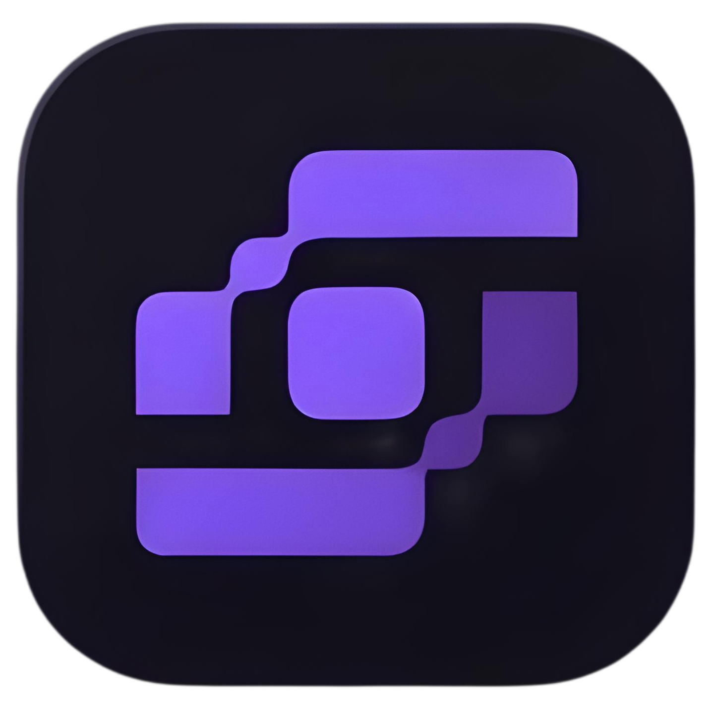

<h1 style="margin: 0;">Kinoflux Whisper Studio</h1>

Kinoflux Whisper Studio is a user-friendly desktop application that uses OpenAI's Whisper AI models to generate accurate transcripts and subtitles from audio files. Perfect for content creators, researchers, podcasters, and anyone needing quick audio-to-text conversion. It supports multiple audio formats and provides outputs in SRT (for subtitles) or TXT (plain text).

## Key Features

- **Easy Audio Upload:** Select your audio files (WAV, MP3, FLAC, M4A, OGG, etc.) with a simple file picker.
- **AI-Powered Transcription:** Leverage Whisper models for high-accuracy speech-to-text, including timestamped subtitles.
- **Real-Time Progress:** View processing logs as the app works on your file.
- **Output Options:** Download subtitles in SRT format (with precise timings) or full transcripts in TXT.
- **Model Selection:** Choose from various Whisper models in settings for different accuracy/speed trade-offs.
- **Cross-Platform:** Built for Windows (with plans for macOS/Linux); lightweight and efficient.

## Installation

1. Visit the [Releases](https://github.com/ntxmproducts/kinoflux-whisperstudio/releases/) page on GitHub.
2. Download the latest installer for your platform (e.g., `Kinoflux.WhisperStudio_0.1.0_x64-setup.exe` for Windows).
3. Run the installer and follow the on-screen instructions.
4. Launch the app from your desktop or start menu.

**System Requirements:**

- Windows 10/11 (64-bit)
- At least 4GB RAM (8GB recommended for larger files)
- Internet connection for initial model downloads (models are cached locally afterward)

## Usage

1. **Launch the App:** Open Kinoflux Whisper Studio.
2. **Select Audio:** Click "Upload Audio" and choose your file.
3. **Choose Model:** If not set, go to Settings to select a Whisper model (e.g., tiny.en, base.en, etc. for English).
4. **Generate:** Click "Generate Subtitles" and wait for processing (time depends on file length and model).
5. **Preview & Download:** View the subtitle preview, then download SRT or TXT files (saved next to your audio file).
6. **Explore More:** Check FAQ for tips or Privacy for data handling info.

For best results, use clear audio in English. Larger models provide better accuracy but take longer.

## Releases

Check the [GitHub Releases](https://github.com/ntxmproducts/kinoflux-whisperstudio/releases/) for the latest version. Each release includes:

- Windows installer (NSIS package)
- Changelog with new features, bug fixes, and improvements
- SHA256 checksums for verification

Current Version: 0.1.0 (Initial release with core transcription features)

## FAQ

- **How long does processing take?** Depending on your hardware and model.
- **Supported Languages?** Primarily English; expand via different Whisper models.
- **Where are models stored?** In the app/locally downloadable.
- **Privacy?** All processing is local on your device and no audio is sent to servers.
- **Issues?** Report bugs via GitHub Issues or check the in-app FAQ page.

## License

Proprietary. All rights reserved. commercial redistribution not allowed without permissions.
Developed by Nitiksh.
