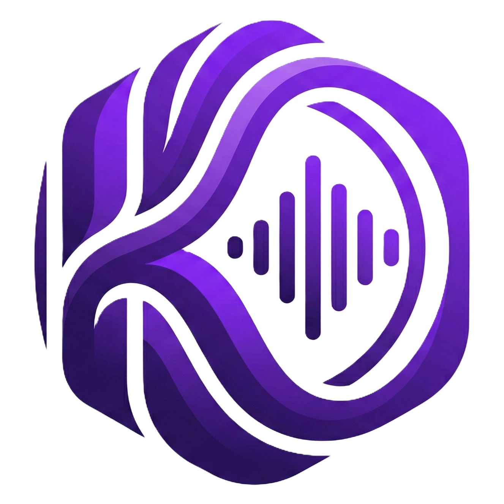
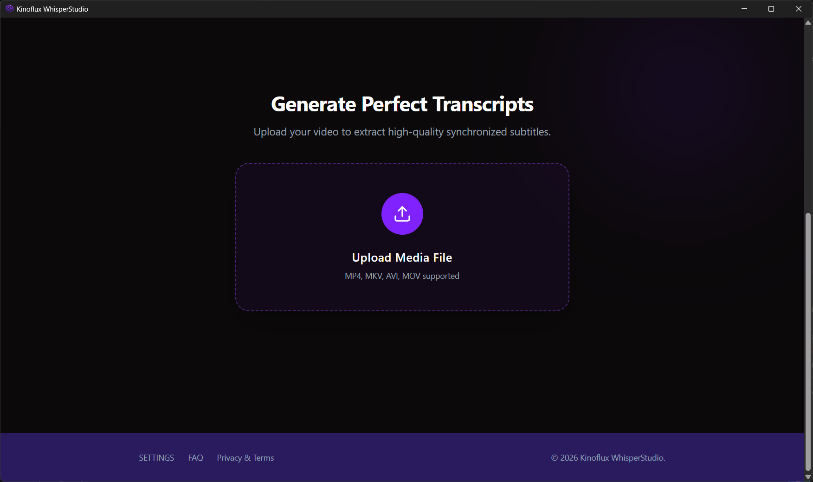
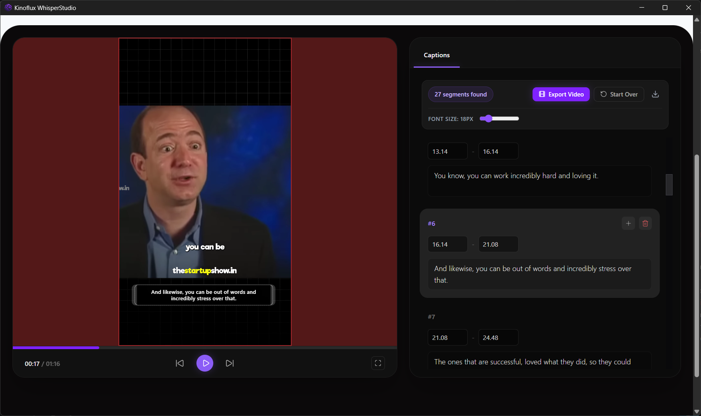
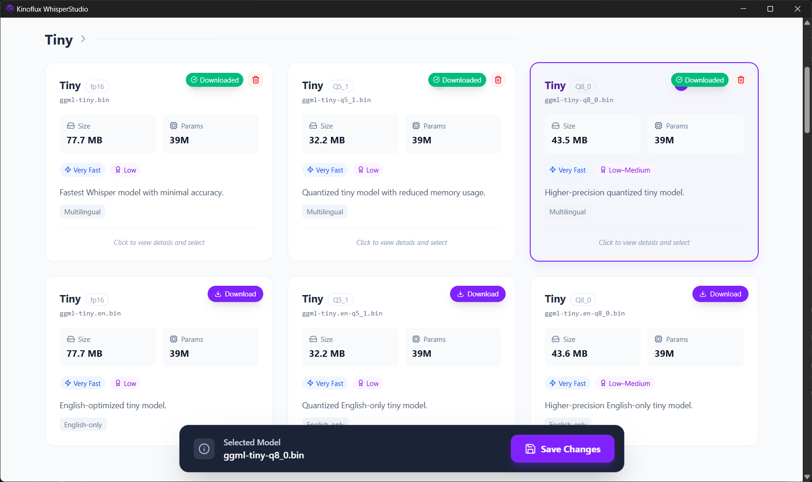
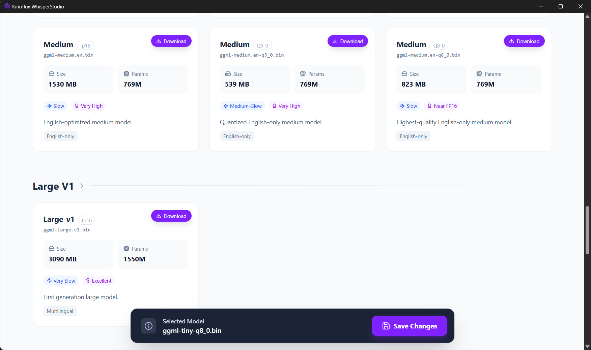

<h1 style="margin: 0;">Kinoflux Whisper Studio</h1>

**Convert audio and video to accurate transcripts and subtitles in seconds.**

Kinoflux Whisper Studio uses OpenAI's Whisper AI to generate professional-quality transcripts, subtitles, and hard-coded captions. Upload your media, select a model, and get results instantly.

## What You Can Do

✅ **Transcribe Audio** – Extract text from MP3, WAV, FLAC, M4A, and more  
✅ **Generate Subtitles** – Get timestamped SRT files for any video  
✅ **Burn Captions** – Hard-code subtitles directly into your video  
✅ **Choose Your Model** – Pick from Tiny (fast) to Large (most accurate)  
✅ **Export Multiple Formats** – SRT for subtitles, TXT for transcripts

## Screenshots

### Upload & Transcribe

### Preview & Edit Subtitles

### Choose Your Model

## Get Started

1. **[Download the latest version](https://github.com/ntxmproducts/kinoflux-whisperstudio/releases/)** – Windows installer (64-bit)
2. **Install & Launch** – Run the setup and open the app
3. **Upload Media** – Drag or select your audio/video file
4. **Select Model** – Choose accuracy level in Settings
5. **Export** – Download your subtitles or transcript

## System Requirements

- Windows 10/11 (64-bit)
- 4GB RAM (8GB+ recommended)
- Internet for initial model download (models cache locally)

## Key Features

- **Local Processing** – Your files never leave your device
- **Fast & Accurate** – Powered by OpenAI's Whisper
- **Multiple Models** – From ultra-fast to ultra-accurate
- **Real-Time Logs** – Watch the processing happen
- **Easy Exports** – One-click downloads

## FAQ

**How long does it take?**  
Depends on file length and model. Tiny models are faster; larger models are more accurate.

**What languages work?**  
Primarily English. Other languages supported via Whisper models.

**Is my data private?**  
Yes. All processing happens locally on your device—nothing is sent anywhere.

**Need help?**  
Check the in-app FAQ, report bugs on [GitHub Issues](https://github.com/ntxmproducts/kinoflux-whisperstudio/issues), or visit Privacy & Terms in the app.

---

**Current Version:** 0.1.0 | Developed by Nitiksh | [Releases](https://github.com/ntxmproducts/kinoflux-whisperstudio/releases/)

_Proprietary software. All rights reserved._
